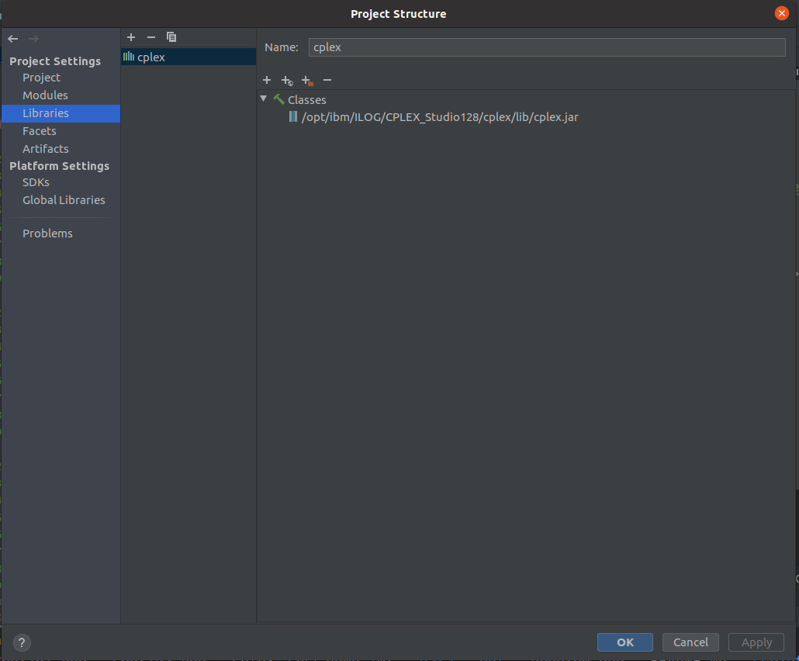
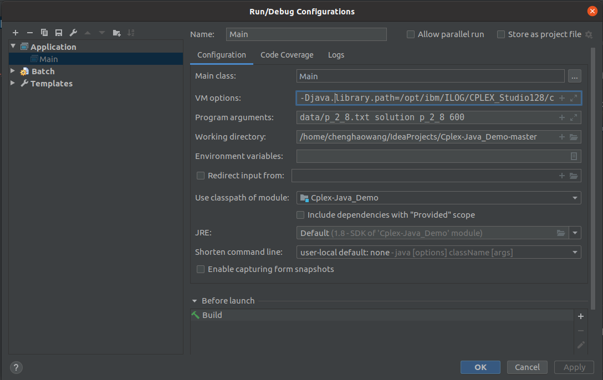
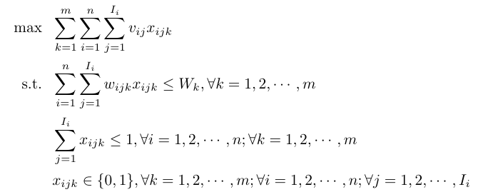

A simple java demo to integrate cplex library.
##configuration of program
1. Load the cplex library into project (Ctrl+Alt+Shift+S) as shown below:

2. Add library-link to program (Run->Edit Configurations) with correct version and path: 
>> -Djava.library.path=/opt/ibm/ILOG/CPLEX_Studio1271/cplex/bin/x86-64_linux

3. Run->Edit Configurations->Program arguments: instance_path solution_dir instance_out timeElapsed
>> Ex: data/p_2_8.txt solution p_2_8.txt 600
# Problem Description
Consider n mutually disjoint classes I1, I2, ... Ii,...,In of items to be packed into m knapsacks of capacity Wk, k=1,2,...,m. Each item j in Ni has a profit vij and a weight wijk, and the problem is to choose at most one item from each class into each knapsack such that the profit sum is maximized without exceeding the capacity Wk in the corresponding weight sum. 
# Mathematical Model

# Data format
m: the number of knapsacks.

n: the number of items.

Wk: the weight of each knapsack, k=1,2,...,m. 

Ii: the number of each type item, i=1,2,...,n.

vij: value of each item of each type, i=1,2,...,n;j=1,2,...,Ii. 

wijk: the weight of each item of each type packed in each knapsack, i=1,2,...,n;j=1,2,...,Ii; k=1,2,...,m.

# Run from script
## For Windows
Change your number of parallel process in script file task.bat via:
>> set NUM_PARALLEL=5

Change your time limitation for solving each instance in script file task.bat via:
>> set TIME_ELAPSED=600

To run script from desktop
>> Click directly the script file "task.bat" in Folder Explorer.

To run script from terminal==>Press Win+R and type cmd and click Enter, go the script directory by command "cd". Then type:
>> call task.bat

## For Linux, e.g, Ubuntu
Change your time limitation for solving each instance in script file runBatchTaskBatch.sh via:
>> timeLimit=600

To run script from terminal
>> ./runBatchTaskBatch.sh number_of_parallel_threads name_of_task_file

>> Ex: ./runBatchTaskBatch.sh 2 Task.txt